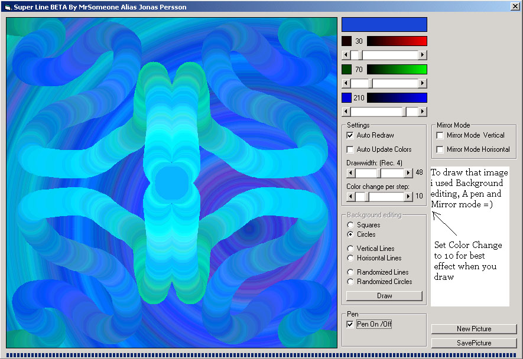



## \[\*A Cool Paint, Draw Program \[Super Line\]\*\]

### Description

Draws nice images with help from the line(x1,y1)-(x2,y2)
 
### More Info
 

             |
---                |---
**Submitted On**   |2002-01-11 00:45:14
**By**             |[MrSomeone](https://github.com/Planet-Source-Code/PSCIndex/blob/master/ByAuthor/mrsomeone.md)
**Level**          |Intermediate
**User Rating**    |4.6 (92 globes from 20 users)
**Compatibility**  |VB 4\.0 \(16\-bit\), VB 4\.0 \(32\-bit\), VB 6\.0
**Category**       |[Graphics](https://github.com/Planet-Source-Code/PSCIndex/blob/master/ByCategory/graphics__1-46.md)
**World**          |[Visual Basic](https://github.com/Planet-Source-Code/PSCIndex/blob/master/ByWorld/visual-basic.md)
**Archive File**   |[A\_Cool\_Pai477531102002\.zip](https://github.com/Planet-Source-Code/mrsomeone-a-cool-paint-draw-program-super-line__1-30658/archive/master.zip)

